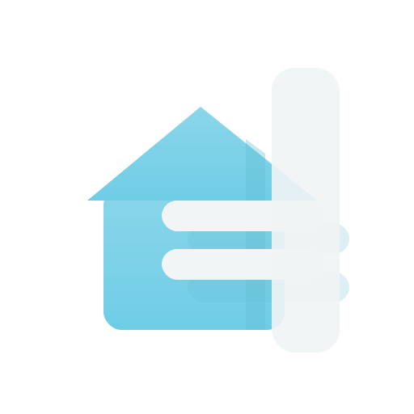

 
  <h1>QuickBars for Home Assistant</h1>
  
  

    Home Assistant on your Android TV!
  

  
  

  
  
  
  
  
  

   
<h4>
    <a href="https://quickbars.app/">Official Website</a>
   · 
    <a href="https://quickbars.app/guide">Documentation</a>
   · 
    <a href="https://github.com/Trooped/QuickBars/issues/">Report Bug</a>
   · 
    <a href="https://github.com/Trooped/QuickBars/issues/">Request Feature</a>
  </h4>

 

# :notebook_with_decorative_cover: Table of Contents

- [About the Project](#star2-about-the-project)
- [Contributing](#wave-contributing)
- [License](#warning-license)
- [Contact](#handshake-contact)
  
## :star2: About the Project

QuickBars was born out of a simple need: making smart home control accessible on the big screen. Originally developed to help my father interact with Home Assistant via larger, more readable controls, it has grown into a powerful tool downloaded by over 16,000 users worldwide.

It provides a fast, dynamic overlay that works over any app on your TV, ensuring your most-used Home Assistant actions are always just a click or two away.

### Key Capabilities:
- **Fast Overlays**: Control entities via remote-accessible sidebars.
- **Key Mapping**: Map physical remote keys (single/double/long press) to HA actions.
- **Real-time Updates**: Local connection via Home Assistant WebSocket API.
- **Camera PiPs**: Camera PiP overlay for live viewing while you're watching TV.
- **Rich Notifications**: TV-optimized alerts with images and action buttons.

For a full feature breakdown and user guides, visit the [Official Website](https://quickbars.app/).

## :wave: Contributing

Please visit [Contributing](CONTRIBUTING.md) for instructions on how to contribute to the project.

## :warning: License

Distributed under the GNU General Public License v3.0 (GPLv3). See `LICENSE` for more information.

## :handshake: Contact

Omri Peretz - [Official Website](https://quickbars.app)

Project Link: [https://github.com/Trooped/QuickBars](https://github.com/Trooped/QuickBars)
